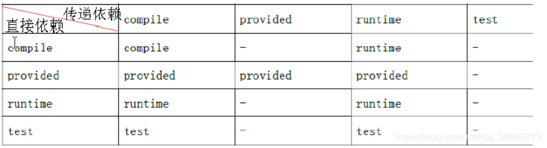

## Maven 父子工程

+ 工程只能使用自己的内部资源 ，也可以和其他工程或者模块建立关系

+ 模块不是独立的，模块天生是属于父工程的，父工程的资源都可以使用
  + 子模块可以直接继承父模块一些资源
  + 子模块和子模块之间没有任何关系 

**父子工程之间的传递依赖与直接依赖**

- 1.首先在父工程导入所有需要jar包的坐标。
- 2.第二子工程可以直接使用父工程的资源，此时子工程与父工程是直接依赖。
- 3.但是子工程与父工程中的jar包都是间接依赖。
- 如下图所示（- 表示无法依赖），比如junit，在子工程（传递依赖）作用区为test，但是父子工程（直接依赖）作用为compile，表示此依赖丢失，jar包坐标导不进去，我们就只能在导入一次。

