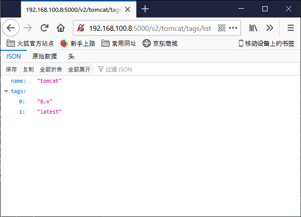

## Docker-Compose安装服务端Registry

```yaml
root@ubuntu2:/usr/local/docker/registry# vim docker-compose.yml 

version: '3.7'
services:
  registry:
    image: registry
    restart: always
    container_name: registry
    ports:
      - 5000:5000
    volumes:
      - /usr/local/docker/registry/data:/var/lib/registry
```

```bash
root@ubuntu2:/usr/local/docker/registry# docker-compose up -d   
Creating network "registry_default" with the default driver
Creating registry            ... done
Creating registry_frontend_1 ... done
```

访问地址

<http://192.168.100.8:5000/v2/>

## Docker-Compose安装客户端Registry

```bash
#修改加速器ip地址
root@andre:/etc/docker# vim daemon.json 
{
        "registry-mirrors": [
                "http://registry.docker-cn.com"
        ],
        "insecure-registries":[
                "192.168.100.8:5000"
        ]
}

#重启docker
root@andre:/etc/docker# systemctl restart docker
#查看是否配置成功
root@andre:/etc/docker# docker info
#客户端先从中央仓库拉取一个镜像
root@andre:/etc/docker# docker pull tomcat
#标记本地镜像并指向目标仓库(tag [本地镜像名] 为 [xx.xx.xxx.xx:port/标记版本名:标记版本号])
root@andre:/etc/docker# docker tag tomcat 192.168.100.8:5000/tomcat
#提交镜像到私服
root@andre:/etc/docker# docker push 192.168.100.8:5000/tomcat
```

+ 服务器查看版本列表

+ http://192.168.100.8:5000/v2/tomcat/tags/list

```bash
#重新打个标签
root@andre:/etc/docker# docker tag tomcat 192.168.100.8:5000/tomcat:8.x
#再次push
root@andre:/etc/docker# docker push 192.168.100.8:5000/tomcat:8.x
```




## docker-registry-frontend安装图形界面-服务端设置

+ 在原来基础上增加下列行，dokcercompose支持多个服务一起

```yaml
root@ubuntu2:/usr/local/docker/registry# vim docker-compose.yml 

version: '3.7'
services:
  registry:
    image: registry
    restart: always
    container_name: registry
    ports:
      - 5000:5000
    volumes:
      - /usr/local/docker/registry/data:/var/lib/registry
  frontend:
      image: konradkleine/docker-registry-frontend:v2
      restart: always
      ports:
        - 8080:80
      volumes:
        - ./certs/frontend.crt:/etc/apache2/server.crt:ro
        - ./certs/frontend.key:/etc/apache2/server.key:ro
      environment:
        - ENV_DOCKER_REGISTRY_HOST=192.168.100.8
        - ENV_DOCKER_REGISTRY_PORT=5000
```

访问地址：http://192.168.100.11:8080

