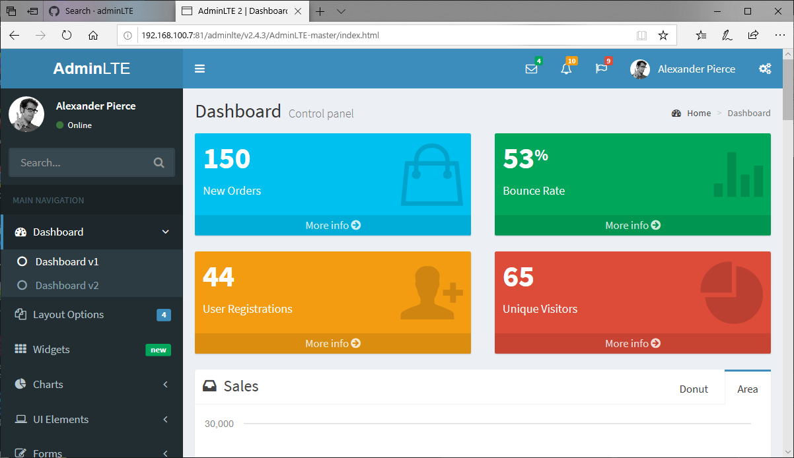

## 负载均衡

```
root@andre:/usr/local/docker/nginx/conf# vim nginx.conf 

worker_processes  1;

events {
user nginx;
worker_processes  1;

events {
    worker_connections  1024;
}

http {
    include       mime.types;
    default_type  application/octet-stream;
    sendfile        on;
    keepalive_timeout  65;
    
    upstream liukakuapp1{
        server 192.168.100.7:9090 weight=10;
        server 192.168.100.7:9091 weight=10;
    }
    
    server {
        listen       80;
        server_name  192.168.100.7;
        
        location / {
            proxy_pass http://liukakuapp1;
            index  index.jsp index.html index.htm;
        }
    }
}
~          
```

**构建CDN服务**

docker-compose.yml 

```
root@andre:/usr/local/docker/nginx# vim docker-compose.yml 

version: '3.7'
services:
  nginx:
    image: nginx
    restart: always
    container_name: nginx
    ports:
      - "81:80"
    volumes:
      - ./conf/nginx.conf:/etc/nginx/nginx.conf
      - ./wwwroot:/usr/share/nginx/wwwroot

```

conf配置

```
root@andre:/usr/local/docker/nginx/conf# vim nginx.conf 

user nginx;
worker_processes  1;

events {
    worker_connections  1024;
}

http {
    include       mime.types;
    default_type  application/octet-stream;
    sendfile        on;
    keepalive_timeout  65;

    server {
        listen       80;
        server_name  192.168.100.11;
        location / {
            root   /usr/share/nginx/wwwroot/cdn;
            index  index.html index.htm;
        }
    }
}

```

```bash
root@andre:/usr/local/docker/nginx/wwwroot/cdn/adminlte/v2.4.3# ls
AdminLTE-master  AdminLTE-master.zip
root@andre:/usr/local/docker/nginx# docker-compose up -d
```

