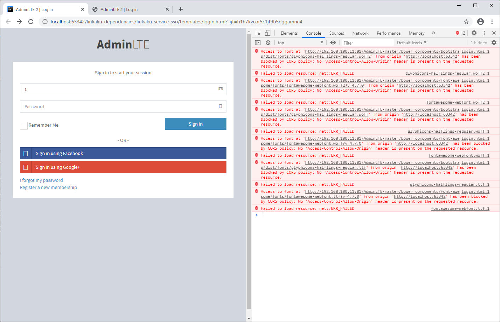

## Nginx 反向代理解决跨域问题

跨域，指的是浏览器不能执行其他网站的脚本。它是由浏览器的同源策略造成的，是浏览器对 JavaScript 施加的安全限制。

Access to font at 'http://192.168.100.11:81/AdminLTE-master/bower_components/bootstrap/dist/fonts/glyphicons-halflings-regular.woff2' from origin 'http://localhost:63342' has been blocked by CORS policy: No 'Access-Control-Allow-Origin' header is present on the requested resource.



```yml
user  nginx;
worker_processes  1;

events {
    worker_connections  1024;
}

http {
    include       mime.types;
    default_type  application/octet-stream;

    sendfile        on;

    keepalive_timeout  65;

    server {
        listen 80;
        server_name upload.myshop.com;
        add_header 'Access-Control-Allow-Origin'  '*';
        add_header 'Access-Control-Allow-Headers' 'DNT,X-CustomHeader,Keep-Alive,User-Agent,X-Requested-With,If-Modified-Since,Cache-Control,Content-Type,Content-Range,Range';
        location / {
            proxy_pass  http://192.168.0.104:8888;
            if ($request_method = 'OPTIONS') {
                add_header Access-Control-Allow-Origin  *;
                add_header Access-Control-Allow-Headers X-Requested-With;
                add_header Access-Control-Allow-Methods GET,POST,PUT,DELETE,PATCH,OPTIONS;
                # 解决假请求问题，如果是简单请求则没有这个问题，但这里是上传文件，首次请求为 OPTIONS 方式，实际请求为 POST 方式
                # Provisional headers are shown.
                # Request header field Cache-Control is not allowed by Access-Control-Allow-Headers in preflight response.
                add_header Access-Control-Allow-Headers DNT,X-CustomHeader,Keep-Alive,User-Agent,X-Requested-With,If-Modified-Since,Cache-Control,Content-Type,Content-Range,Range;
                return 200;
            }
        }
    }
}
```

