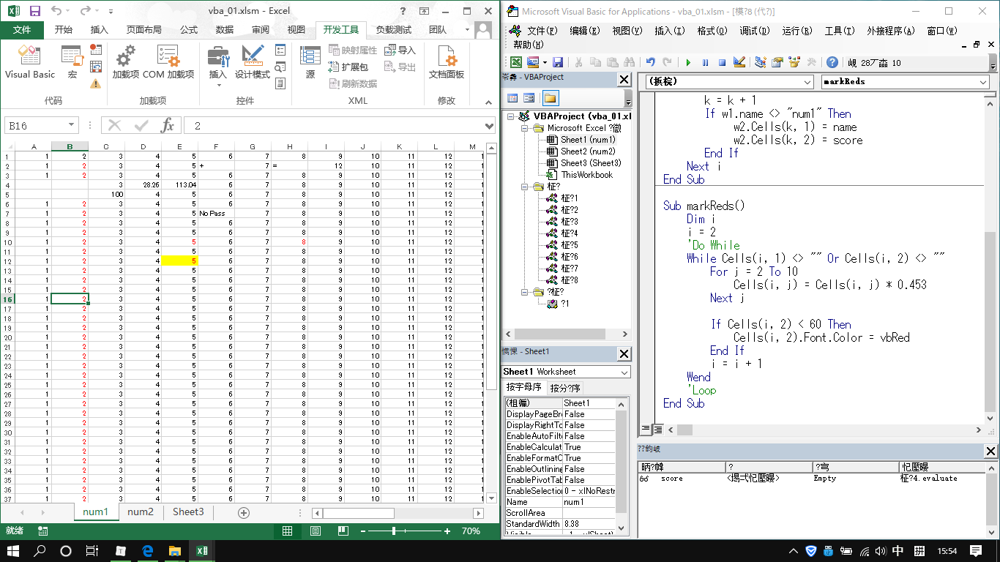

## VBA面向对象

WorkBook(工作簿)

WorkSheet（工作表）

Range（单元格内容区域）

```vb
Option Explicit
Sub test2()
    Dim w1 As Worksheet
    Dim counts As Integer
    counts = Worksheets.Count
    
    For i = 1 To counts
    Set w1 = Worksheets.Add
    w1.Cells(5, 3) = 100
End Sub
```

```vb
Option Explicit
Sub sumAll()

    Dim i, r, s, k, name, score
    Dim w1 As Worksheet, w2 As Worksheet
    
    Call 变红
    
    Set w2 = Worksheets(1)
    
    k = 2
    For i = 1 To Worksheets.Count
       Set w1 = Worksheets(i)
       
       name = w1.Cells(1, 2)
       score = w1.Cells(2, 3)
       
       k = k + 1
       If w1.name <> "num1" Then
            w2.Cells(k, 1) = name
            w2.Cells(k, 2) = score
       End If
    Next i
End Sub

Sub 变红()
    Dim i
    i = 2
    'Do While
    While Cells(i, 1) <> "" Or Cells(i, 2) <> ""
        For j = 2 To 10
            Cells(i, j) = Cells(i, j) * 0.453
        Next j
       
        If Cells(i, 2) < 60 Then
            Cells(i, 2).Font.Color = vbRed
        End If
        i = i + 1
    Wend
    'Loop
End Sub

```



